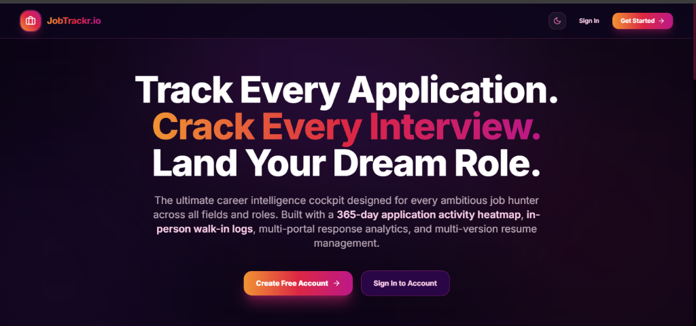
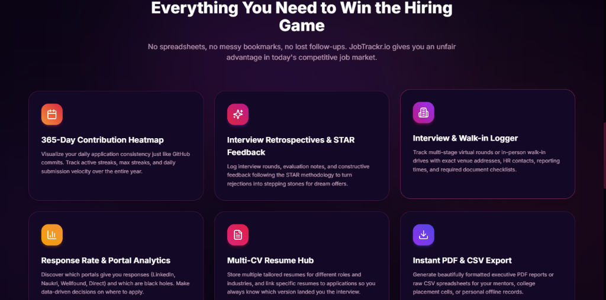
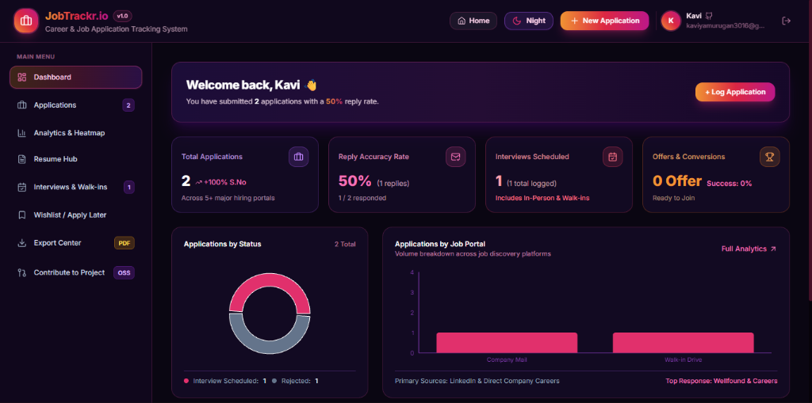
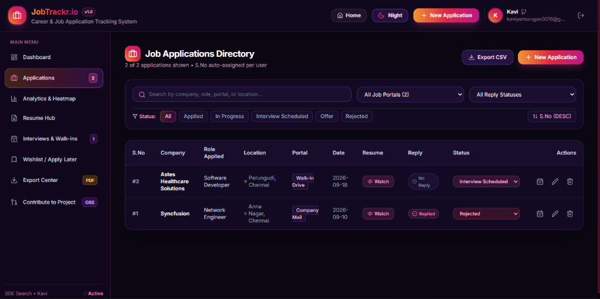
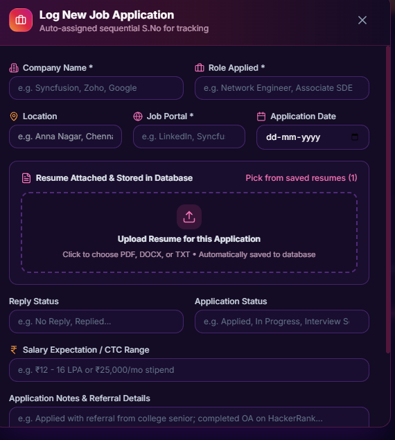

# JobTrackr.io - Career & Job Application Intelligence Platform

> **The Ultimate Career Cockpit for Every Job Hunter**  
> A modern, full-stack application tracker designed for ambitious job seekers across all roles and industries. Built with a 365-day application activity heatmap, response rate analytics, interview & walk-in drive logging, multi-version resume management, AI ATS keyword scoring, and executive PDF/CSV reports.

---

## 📸 Screenshots & Visual Tour

### 1. Landing Page & Hero Section
*Clean, high-energy interface with responsive light/dark themes, fast authentication, and instant onboarding.*



---

### 2. Built for High Performance — Feature Highlights
*Comprehensive feature suite eliminating messy spreadsheets, lost follow-ups, and fragmented resumes.*



---

### 3. Career Analytics Dashboard & Activity Heatmap
*Executive cockpit showcasing total applications, reply accuracy rates, interview conversions, status donut breakdowns, and platform volume charts.*



---

### 4. Job Applications Directory
*Centralized directory with auto-incrementing user sequential numbers (#S.No), multi-portal filtering, search, reply tracking, and quick actions.*



---

### 5. Detailed Application & Walk-in Logger
*Log comprehensive application metadata including role, company, salary/stipend expectations, interview notes, and in-person walk-in drive venue contacts.*

<p align="center">
  
</p>

---

## 🚀 Technology Stack

### Frontend Architecture
* **Core Framework**: [React 18](https://react.dev/) + [TypeScript](https://www.typescriptlang.org/) for strict type safety and component-driven architecture.
* **Build Tool & Bundler**: [Vite 6](https://vitejs.dev/) with lightning-fast Hot Module Replacement (HMR) and optimized rollup chunking.
* **Styling & Design System**:
  * [Tailwind CSS](https://tailwindcss.com/) with custom vibrant gradients, sleek dark mode (`#120824`), and glassmorphism.
  * [PostCSS](https://postcss.org/) & [Autoprefixer](https://github.com/postcss/autoprefixer).
  * `clsx` & `tailwind-merge` for robust conditional class management.
* **Iconography**: [Lucide React](https://lucide.dev/) (20+ semantic vector icons).
* **Data Visualization**:
  * [Recharts](https://recharts.org/) for application trend lines, portal response bar graphs, and status donut charts.
  * Custom 365-day SVG application consistency matrix (GitHub-style activity heatmap).
* **Date Utilities**: [date-fns](https://date-fns.org/) for timeline formatting, active streak tracking, and velocity metrics.

### Backend Architecture
* **Server Runtime**: [Node.js](https://nodejs.org/) (ES Modules).
* **API Framework**: [Express.js](https://expressjs.com/) with TypeScript for REST API routing, request validation, and modular controllers.
* **Development Engine**: [tsx](https://github.com/privatenumber/tsx) for zero-config TypeScript execution and hot reloading (`tsx watch`).
* **Security & Middleware**: [CORS](https://www.npmjs.com/package/cors) for secure cross-origin resource sharing, and [dotenv](https://www.npmjs.com/package/dotenv) for environment variable encapsulation.

### Database & Storage (Dual-Engine Architecture)
JobTrackr.io features a plug-and-play dual database engine:
* **Local Mode (Default / Zero-Config)**: 
  * [better-sqlite3](https://github.com/WiseLibs/better-sqlite3) for high-performance, embedded, file-based relational storage with automated schema creation and realistic data seeding.
* **Cloud Mode (Optional)**:
  * [Supabase](https://supabase.com/) ([@supabase/supabase-js](https://www.npmjs.com/package/@supabase/supabase-js)) for hosted PostgreSQL, cloud auth rules, and cloud object storage.

### Authentication & Cryptography
* **Authentication Tokens**: [JSON Web Tokens (JWT)](https://jwt.io/) ([`jsonwebtoken`](https://www.npmjs.com/package/jsonwebtoken)) with 30-day session expiry.
* **Password Security**: [bcryptjs](https://www.npmjs.com/package/bcryptjs) with one-way salted hashing.
* **Key Generation**: [uuid](https://www.npmjs.com/package/uuid) (`v4`) for universally unique record identification.

### Document Generation & File Handling
* **Resume Uploads**: [Multer](https://github.com/expressjs/multer) for multi-part file processing (`.pdf`, `.docx`, `.txt`).
* **Client-Side Document Export**:
  * [jsPDF](https://github.com/parallax/jsPDF) & [jspdf-autotable](https://github.com/simonbengtsson/jsPDF-AutoTable) for client-side generated, beautifully styled PDF executive reports.
  * Native browser Blob/CSV streamer for spreadsheet exports.

### AI & Career Intelligence
* **Cloud AI**: [OpenAI API](https://github.com/openai/openai-node) (`gpt-4o-mini`) for real-time ATS keyword scoring, role matching, and Google XYZ resume bullet refinement.
* **Heuristic Offline Fallback**: Built-in algorithmic fallback logic so keyword scoring and application analytics function 100% offline without requiring an API key.

### DevOps & Deployment
* **Orchestration**: [concurrently](https://www.npmjs.com/package/concurrently) to boot both frontend and backend concurrently in local development (`npm run dev`).
* **Cloud Hosting Configs**:
  * **Frontend**: Configured for [Vercel](https://vercel.com/) via `vercel.json` SPA routing rewrites.
  * **Backend**: Configured for [Render](https://render.com/) via `render.yaml`.
* **Version Control**: Git & [GitHub](https://github.com/Kaviya-3016/JobTrackr.io).

---

## 🌟 Key Features

### Phase 1 - Core Tracking & Directory
* **Auto-Incrementing S.No**: Each user's job applications are automatically assigned their own sequential `#S.No` starting from 1.
* **Full CRUD Application Table**: Track company name, role applied, location, hiring portal (LinkedIn, Naukri, Wellfound, Direct Careers, etc.), application date, attached resume version, reply status (`No Reply` / `Replied`), application status (`Applied`, `In Progress`, `Interview Scheduled`, `Offer`, `Rejected`), salary/stipend range, and referral details.
* **Real-Time Filters & Search**: Search by company or role, filter by portal, filter by reply status, and filter by pipeline stages.

### Phase 2 - Advanced Analytics & 365-Day Heatmap
* **365-Day Activity Heatmap**: 52-week contribution matrix visualizing daily application consistency, active streaks, max streaks, and daily submission velocity.
* **Daily Trend Line Chart**: Area chart charting application velocity over the last 60 days.
* **Weekly & Monthly Velocity**: Grouped charts comparing total applications vs responses vs offers.
* **Reply Accuracy Rate**: `(replies received / total applications) * 100` calculated overall and broken down per job discovery platform.
* **Interview Success Rate**: `(offers / attended interviews) * 100` with virtual vs in-person walk-in breakdown.

### Phase 3 - Resume Database & AI Career Advisor
* **Resume Hub**: Upload multiple resume versions, designate your active CV, and preview files directly in the browser.
* **ATS Keyword Scorer**: Scan any resume against target job descriptions to get an ATS compatibility score (0-100), grade (A+, A, B+), matched keywords, and missing keywords with one-click copy.
* **FAANG Resume Feedback**: Before & after bullet point critiques using Google's XYZ formula (*"Accomplished X by doing Y as measured by Z"*).
* **Smart Role Recommendations**: Evaluates target roles and experience to recommend high-conversion positions with match probability % and salary expectations.
* **Rejection Pattern Analysis**: Identifies interview gaps and generates actionable preparation steps.

### Phase 4 - Interviews, Wishlist & Reports
* **Interviews & Walk-in Tracker**: Track interview rounds, statuses, and dedicated in-person walk-in drive venue details (venue address, HR contact person, documents required).
* **Constructive Rejection Logging**: Record rejection reasons, feedback notes, and get AI suggestions.
* **Wishlist / Apply Later Queue**: Save target companies and roles with one-click conversion to active applications with auto S.No.
* **Export Center**: Download filtered application history as CSV spreadsheets or multi-page executive PDF reports.

---

## 📁 Database Schema

```sql
-- users table
CREATE TABLE users (
  id UUID PRIMARY KEY DEFAULT uuid_generate_v4(),
  email TEXT UNIQUE NOT NULL,
  password_hash TEXT NOT NULL,
  name TEXT DEFAULT 'Kavi',
  phone TEXT DEFAULT '+91-7418082136',
  portfolio TEXT DEFAULT 'https://github.com/Kaviya-3016',
  bio TEXT,
  created_at TIMESTAMP DEFAULT CURRENT_TIMESTAMP
);

-- resumes table
CREATE TABLE resumes (
  id UUID PRIMARY KEY DEFAULT uuid_generate_v4(),
  user_id UUID REFERENCES users(id) ON DELETE CASCADE,
  resume_name TEXT NOT NULL,
  file_url TEXT NOT NULL,
  ats_score INT DEFAULT 75,
  is_active BOOLEAN DEFAULT FALSE,
  uploaded_date TIMESTAMP DEFAULT CURRENT_TIMESTAMP
);

-- job_applications table
CREATE TABLE job_applications (
  id UUID PRIMARY KEY DEFAULT uuid_generate_v4(),
  user_id UUID REFERENCES users(id) ON DELETE CASCADE,
  s_no INT NOT NULL,
  company_name TEXT NOT NULL,
  role_applied TEXT NOT NULL,
  job_location TEXT NOT NULL,
  job_portal TEXT NOT NULL,
  application_date DATE NOT NULL,
  resume_used_id UUID REFERENCES resumes(id) ON DELETE SET NULL,
  reply_status TEXT CHECK (reply_status IN ('No Reply', 'Replied')) DEFAULT 'No Reply',
  application_status TEXT CHECK (application_status IN ('Applied', 'In Progress', 'Rejected', 'Interview Scheduled', 'Offer')) DEFAULT 'Applied',
  notes TEXT,
  salary_range TEXT,
  created_at TIMESTAMP DEFAULT CURRENT_TIMESTAMP,
  updated_at TIMESTAMP DEFAULT CURRENT_TIMESTAMP
);

-- interviews table
CREATE TABLE interviews (
  id UUID PRIMARY KEY DEFAULT uuid_generate_v4(),
  job_application_id UUID REFERENCES job_applications(id) ON DELETE CASCADE,
  interview_date DATE NOT NULL,
  interview_type TEXT DEFAULT 'Virtual',
  interview_status TEXT DEFAULT 'Scheduled',
  is_walk_in BOOLEAN DEFAULT FALSE,
  walk_in_details TEXT,
  round_name TEXT DEFAULT 'Technical Round 1',
  notes TEXT,
  created_at TIMESTAMP DEFAULT CURRENT_TIMESTAMP
);

-- rejections_feedback table
CREATE TABLE rejections_feedback (
  id UUID PRIMARY KEY DEFAULT uuid_generate_v4(),
  interview_id UUID REFERENCES interviews(id) ON DELETE CASCADE,
  rejection_reason TEXT,
  detailed_notes TEXT,
  improvement_suggestions TEXT,
  created_at TIMESTAMP DEFAULT CURRENT_TIMESTAMP
);

-- waitlist_jobs table
CREATE TABLE waitlist_jobs (
  id UUID PRIMARY KEY DEFAULT uuid_generate_v4(),
  user_id UUID REFERENCES users(id) ON DELETE CASCADE,
  company_name TEXT NOT NULL,
  role TEXT NOT NULL,
  job_url TEXT,
  notes TEXT,
  status TEXT CHECK (status IN ('Wishlist', 'Applied', 'Completed')) DEFAULT 'Wishlist',
  salary_expectation TEXT,
  added_date TIMESTAMP DEFAULT CURRENT_TIMESTAMP
);
```

---

## 🏃 Local Setup & Running

### Prerequisites
* **Node.js**: v18+ (tested on Node v20/v22/v24)
* **npm**: v9+

### Quick Start

1. **Clone the repository**:
   ```bash
   git clone https://github.com/Kaviya-3016/JobTrackr.io.git
   cd JobTrackr.io
   ```

2. **Install all dependencies**:
   ```bash
   npm run install:all
   ```

3. **Start both backend and frontend concurrently**:
   ```bash
   npm run dev
   ```
   * **Client**: Runs on `http://localhost:5173`
   * **Server**: Runs on `http://localhost:5000`

4. Open your browser and navigate to **`http://localhost:5173/`**.

---

## 🔑 Environment Configuration

In `server/.env`:

```env
PORT=5000
NODE_ENV=development
JWT_SECRET=super_secret_kavi_job_tracker_key_2026

# Optional: Remote Supabase Connection
SUPABASE_URL=https://your-project.supabase.co
SUPABASE_SERVICE_ROLE_KEY=your-supabase-service-role-key

# Optional: OpenAI API Key for Live GPT-4o-mini Analysis
OPENAI_API_KEY=sk-...
```

> **Note**: If `SUPABASE_URL` and `OPENAI_API_KEY` are left blank, JobTrackr.io automatically runs completely offline on the embedded SQLite database with local heuristic AI.

---

## 📄 License

Distributed under the **MIT License**. See [LICENSE](LICENSE) for more details.
